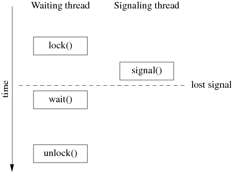
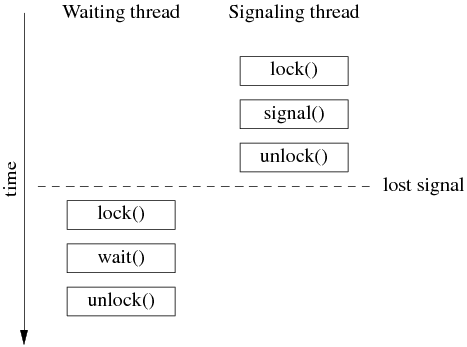

# 用条件变量实现事件等待器的正确与错误做法

TL;DR 如果你能一眼看出 [https://gist.github.com/chenshuo/6430925](https://gist.github.com/chenshuo/6430925 "https://gist.github.com/chenshuo/6430925") 中的那 8 个 Waiter classes 哪些是对的哪些是错的，本文就不必看了。

前几天，我发了一条微博 [http://weibo.com/1701018393/A7FrW7ZVd](http://weibo.com/1701018393/A7FrW7ZVd "http://weibo.com/1701018393/A7FrW7ZVd") ，质疑某本书对 Pthreads 条件变量的封装是错的，因为它没有把 mutex 的 lock()/unlock() 函数暴露出来，导致无法实用。后来大家讨论的分歧是这个 cond class 是不是通用的条件变量封装，还是只是一个特殊的 “事件等待器”。作为事件等待器，其实现也是错的，因为存在丢失事件的可能，可以算是初学者使用条件变量的典型错误。

本文的代码位于 [recipes/thread/test/Waiter_test.cc](https://github.com/chenshuo/recipes/blob/master/thread/test/Waiter_test.cc)，这里提到的某书的版本相当于 Waiter1 class。

我在拙作《Linux 多线程服务端编程：使用 muduo C++ 网络库》第 2.2 节总结了条件变量的使用要点：

条件变量只有一种正确使用的方式，几乎不可能用错。对于 wait 端：
1. 必须与 mutex 一起使用，该布尔表达式的读写需受此 mutex 保护。
2. 在 mutex 已上锁的时候才能调用 wait()。
3. 把判断布尔条件和 wait() 放到 while 循环中。

对于 signal/broadcast 端：
1. 不一定要在 mutex 已上锁的情况下调用 signal （理论上）。
2. 在 signal 之前一般要修改布尔表达式。
3. 修改布尔表达式通常要用 mutex 保护（至少用作 full memory barrier）。
4. 注意区分 signal 与 broadcast：“broadcast 通常用于表明状态变化，signal 通常用于表示资源可用。（broadcast should generally be used to indicate state change rather than resource availability。）”

如果用条件变量来实现一个 “事件等待器 / Waiter”，正确的做法是怎样的？我的最终答案见 [WaiterInMuduo class](https://github.com/chenshuo/recipes/blob/master/thread/test/Waiter_test.cc#L239)。“事件等待器” 的一种用途是程序启动时等待初始化完成，也可以直接用 muduo::CountDownLatch 到达相同的目的，将初值设为 1 即可。

以下根据微博上的讨论过程给出几个正确或错误的版本，博大家一笑。**只要记住 Pthread 的条件变量是边沿触发（edge trigger），即 signal()/broadcast() 只会唤醒已经等在 wait() 上的线程 (s)，我们在编码时必须要考虑 signal() 早于 wait() 的可能，那么就很容易判断以下各个版本的正误了**。代码见 [recipes/thread/test/Waiter_test.cc](https://github.com/chenshuo/recipes/blob/master/thread/test/Waiter_test.cc)。

版本一：错误。某书上的原始版，有丢失事件的可能。

版本二：错误。lock() 之后再 signal()，同样有丢失事件的可能。

版本三：错误。引入了 bool signaled_; 条件，但没有正确处理 spurious wakeup。

版本四五六：正确。仅限 single waiter 使用。

版本七：最佳。可供 multiple waiters 使用。

版本八：错误。存在 data race，且有丢失事件的可能。理由见 [http://stackoverflow.com/questions/4544234/calling-pthread-cond-signal-without-locking-mutex](http://stackoverflow.com/questions/4544234/calling-pthread-cond-signal-without-locking-mutex)

总结：使用条件变量，调用 signal() 的时候无法知道是否已经有线程等待在 wait() 上。因此一般总是要先修改 “条件”，使其为 true，再调用 signal()；这样 wait 线程先检查“条件”，只有当条件不成立时才去 wait()，避免了丢事件的可能。换言之，通过使用“条件”，将边沿触发（edge trigger）改为电平触发（level trigger）。这里“修改条件” 和“检查条件”都必须在 mutex 保护下进行，而且这个 mutex 必须用于配合 wait()。

思考题：如果用两个 mutex，一个用于保护 “条件”，另一个专门用于和 cond 配合 wait()，会出现什么情况？

最后注明一点，[http://stackoverflow.com/questions/6419117/signal-and-unlock-order](http://stackoverflow.com/questions/6419117/signal-and-unlock-order) 这篇帖子里对 spurious wakeup 的解释是错的，spurious wakeup 指的是一次 signal() 调用唤醒两个或以上 wait()ing 的线程，或者没有调用 signal() 却有线程从 wait() 返回。manpage 里对 Pthreads 系列函数的介绍非常到位，值得细读。